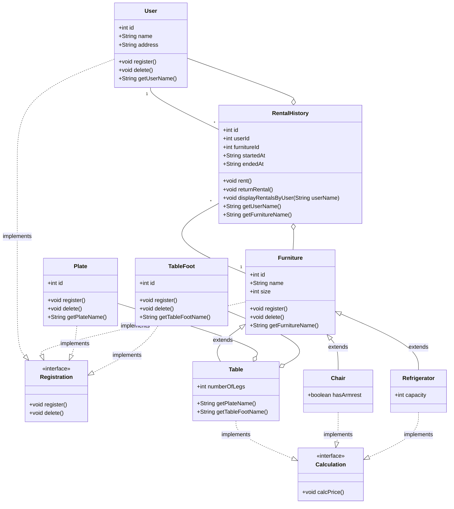

# Javaを用いたUML学習
## 概要
家具のレンタルシステムを作ってみる．

## クラス図

```mermaid
classDiagram
    User "1" -- "*" RentalHistory
    RentalHistory "*" -- "1" Furniture

    class User {
        +int id
        +String name
        +String address
        +void register()
        +void delete()
        +String getUserName()
    }

    class RentalHistory {
        +int id
        +int userId
        +int furnitureId
        +String startedAt
        +String endedAt
        +void rent()
        +void returnRental()
        +void displayRentalsByUser(String userName)
        +String getUserName()
        +String getFurnitureName()
    }

    class Furniture {
        +int id
        +String name
        +int size
        +void register()
        +void delete()
        +String getFurnitureName()
    }

    class Registration {
        <<interface>>
        +void register()
        +void delete()
    }

    class Calculation {
        <<interface>>
        +void calcPrice()
    }

    User ..|> Registration : implements
    Furniture ..|> Registration : implements
    Plate ..|> Registration : implements
    TableFoot ..|> Registration : implements

    Table ..|> Calculation : implements
    Chair ..|> Calculation : implements
    Refrigerator ..|> Calculation : implements

    Furniture <|-- Table : extends
    Furniture <|-- Chair : extends
    Furniture <|-- Refrigerator : extends

    class Table {
        +int numberOfLegs
        +String getPlateName()
        +String getTableFootName()
    }

    class Chair {
        +boolean hasArmrest
    }

    class Refrigerator {
        +int capacity
    }

    class Plate {
        +int id
        +void register()
        +void delete()
        +String getPlateName()
    }

    class TableFoot {
        +int id
        +void register()
        +void delete()
        +String getTableFootName()
    }

    RentalHistory o-- User
    RentalHistory o-- Furniture

    Plate --o Table
    TableFoot --o Table


```